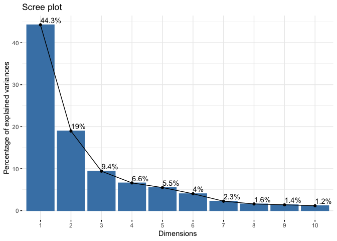

mini-project
================
May Wu PID:A59010588
10/27/2021

## Unsupervised Learning

``` r
# Save your input data file into your Project directory
fna.data <- "WisconsinCancer.csv"

# Complete the following code to input the data and store as wisc.df
wisc.df <- read.csv(fna.data, row.names=1)
wisc.data <- wisc.df[,-1]
```

setup a separate new vector called diagnosis that contains the data from
the diagnosis column of the original dataset. We will store this as a
factor (useful for plotting) and use this later to check our results

``` r
diagnosis = factor(wisc.df$diagnosis)
```

Q1. How many observations are in this dataset? Q2. How many of the
observations have a malignant diagnosis? Q3. How many variables/features
in the data are suffixed with \_mean? The functions dim(), nrow(),
table(), length() and grep() may be useful for answering the first 3
questions above.

``` r
# How many observations are in this dataset?
nrow(wisc.data)
```

    ## [1] 569

``` r
# How many of the observations have a malignant diagnosis?
sum(diagnosis=="M")
```

    ## [1] 212

``` r
#  How many variables/features in the data are suffixed with _mean?
length(grep("_mean$", colnames(wisc.data)))
```

    ## [1] 10

## 2. Principal Component Analysis

Performing PCA The next step in your analysis is to perform principal
component analysis (PCA) on wisc.data.

It is important to check if the data need to be scaled before performing
PCA. Recall two common reasons for scaling data include:

The input variables use different units of measurement. The input
variables have significantly different variances. Check the mean and
standard deviation of the features (i.e. columns) of the wisc.data to
determine if the data should be scaled. Use the colMeans() and apply()
functions like you’ve done before.

``` r
# Check column means and standard deviations
colMeans(wisc.data)
```

    ##             radius_mean            texture_mean          perimeter_mean 
    ##            1.412729e+01            1.928965e+01            9.196903e+01 
    ##               area_mean         smoothness_mean        compactness_mean 
    ##            6.548891e+02            9.636028e-02            1.043410e-01 
    ##          concavity_mean     concave.points_mean           symmetry_mean 
    ##            8.879932e-02            4.891915e-02            1.811619e-01 
    ##  fractal_dimension_mean               radius_se              texture_se 
    ##            6.279761e-02            4.051721e-01            1.216853e+00 
    ##            perimeter_se                 area_se           smoothness_se 
    ##            2.866059e+00            4.033708e+01            7.040979e-03 
    ##          compactness_se            concavity_se       concave.points_se 
    ##            2.547814e-02            3.189372e-02            1.179614e-02 
    ##             symmetry_se    fractal_dimension_se            radius_worst 
    ##            2.054230e-02            3.794904e-03            1.626919e+01 
    ##           texture_worst         perimeter_worst              area_worst 
    ##            2.567722e+01            1.072612e+02            8.805831e+02 
    ##        smoothness_worst       compactness_worst         concavity_worst 
    ##            1.323686e-01            2.542650e-01            2.721885e-01 
    ##    concave.points_worst          symmetry_worst fractal_dimension_worst 
    ##            1.146062e-01            2.900756e-01            8.394582e-02 
    ##                       X 
    ##                      NA

``` r
apply(wisc.data,2,sd)
```

    ##             radius_mean            texture_mean          perimeter_mean 
    ##            3.524049e+00            4.301036e+00            2.429898e+01 
    ##               area_mean         smoothness_mean        compactness_mean 
    ##            3.519141e+02            1.406413e-02            5.281276e-02 
    ##          concavity_mean     concave.points_mean           symmetry_mean 
    ##            7.971981e-02            3.880284e-02            2.741428e-02 
    ##  fractal_dimension_mean               radius_se              texture_se 
    ##            7.060363e-03            2.773127e-01            5.516484e-01 
    ##            perimeter_se                 area_se           smoothness_se 
    ##            2.021855e+00            4.549101e+01            3.002518e-03 
    ##          compactness_se            concavity_se       concave.points_se 
    ##            1.790818e-02            3.018606e-02            6.170285e-03 
    ##             symmetry_se    fractal_dimension_se            radius_worst 
    ##            8.266372e-03            2.646071e-03            4.833242e+00 
    ##           texture_worst         perimeter_worst              area_worst 
    ##            6.146258e+00            3.360254e+01            5.693570e+02 
    ##        smoothness_worst       compactness_worst         concavity_worst 
    ##            2.283243e-02            1.573365e-01            2.086243e-01 
    ##    concave.points_worst          symmetry_worst fractal_dimension_worst 
    ##            6.573234e-02            6.186747e-02            1.806127e-02 
    ##                       X 
    ##                      NA

``` r
# Perform PCA on wisc.data by completing the following code
wisc.data = subset (wisc.data, select = -X)
wisc.pr <- prcomp(wisc.data , scale. = TRUE)
summary(wisc.pr)
```

    ## Importance of components:
    ##                           PC1    PC2     PC3     PC4     PC5     PC6     PC7
    ## Standard deviation     3.6444 2.3857 1.67867 1.40735 1.28403 1.09880 0.82172
    ## Proportion of Variance 0.4427 0.1897 0.09393 0.06602 0.05496 0.04025 0.02251
    ## Cumulative Proportion  0.4427 0.6324 0.72636 0.79239 0.84734 0.88759 0.91010
    ##                            PC8    PC9    PC10   PC11    PC12    PC13    PC14
    ## Standard deviation     0.69037 0.6457 0.59219 0.5421 0.51104 0.49128 0.39624
    ## Proportion of Variance 0.01589 0.0139 0.01169 0.0098 0.00871 0.00805 0.00523
    ## Cumulative Proportion  0.92598 0.9399 0.95157 0.9614 0.97007 0.97812 0.98335
    ##                           PC15    PC16    PC17    PC18    PC19    PC20   PC21
    ## Standard deviation     0.30681 0.28260 0.24372 0.22939 0.22244 0.17652 0.1731
    ## Proportion of Variance 0.00314 0.00266 0.00198 0.00175 0.00165 0.00104 0.0010
    ## Cumulative Proportion  0.98649 0.98915 0.99113 0.99288 0.99453 0.99557 0.9966
    ##                           PC22    PC23   PC24    PC25    PC26    PC27    PC28
    ## Standard deviation     0.16565 0.15602 0.1344 0.12442 0.09043 0.08307 0.03987
    ## Proportion of Variance 0.00091 0.00081 0.0006 0.00052 0.00027 0.00023 0.00005
    ## Cumulative Proportion  0.99749 0.99830 0.9989 0.99942 0.99969 0.99992 0.99997
    ##                           PC29    PC30
    ## Standard deviation     0.02736 0.01153
    ## Proportion of Variance 0.00002 0.00000
    ## Cumulative Proportion  1.00000 1.00000

Q4. From your results, what proportion of the original variance is
captured by the first principal components (PC1)?

A: 0.4427 Q5. How many principal components (PCs) are required to
describe at least 70% of the original variance in the data?

A: 3 Q6. How many principal components (PCs) are required to describe at
least 90% of the original variance in the data?

A: 7

# Interpreting PCA results

Now you will use some visualizations to better understand your PCA
model. A common visualization for PCA results is the so-called biplot.

However, you will often run into some common challenges with using
biplots on real-world data containing a non-trivial number of
observations and variables. Here we will need to look at some
alternative visualizations. You are encouraged to experiment with
additional visualizations before moving on to the next section

Create a biplot of the wisc.pr using the biplot() function.

``` r
biplot(wisc.pr)
```

<!-- -->

``` r
plot( wisc.pr$x , col = diagnosis , 
     xlab = "PC1", ylab = "PC2")
```

<!-- --> Q8.
Generate a similar plot for principal components 1 and 3. What do you
notice about these plots?

``` r
# Repeat for components 1 and 3
plot(wisc.pr$x[, c("PC1","PC3") ], col = diagnosis, 
     xlab = "PC1", ylab = "PC3")
```

<!-- -->
Overall, the plots indicate that principal component 1 is capturing a
separation of malignant (red) from benign (black) samples. This is an
important and interesting result worthy of further exploration - as we
will do in the next sections!

``` r
# Create a data.frame for ggplot
df <- as.data.frame(wisc.pr$x)
df$diagnosis <- diagnosis

# Load the ggplot2 package
library(ggplot2)

# Make a scatter plot colored by diagnosis
ggplot(df) + 
  aes(PC1, PC2, col=diagnosis) + 
  geom_point()
```

<!-- --> #
Variance explained In this exercise, you will produce scree plots
showing the proportion of variance explained as the number of principal
components increases. The data from PCA must be prepared for these
plots, as there is not a built-in function in base R to create them
directly from the PCA model.

As you look at these plots, ask yourself if there’s an ‘elbow’ in the
amount of variance explained that might lead you to pick a natural
number of principal components. If an obvious elbow does not exist, as
is typical in some real-world datasets, consider how else you might
determine the number of principal components to retain based on the
scree plot.

Calculate the variance of each principal component by squaring the sdev
component of wisc.pr (i.e. wisc.pr$sdev^2). Save the result as an object
called pr.var.

``` r
# Calculate variance of each component
pr.var <- wisc.pr$sdev^2
head(pr.var)
```

    ## [1] 13.281608  5.691355  2.817949  1.980640  1.648731  1.207357

Calculate the variance explained by each principal component by dividing
by the total variance explained of all principal components. Assign this
to a variable called pve and create a plot of variance explained for
each principal component.

``` r
# Variance explained by each principal component: pve
pve <- pr.var / sum(pr.var)

# Plot variance explained for each principal component
plot(pve, xlab = "Principal Component", 
     ylab = "Proportion of Variance Explained", 
     ylim = c(0, 1), type = "o")
```

<!-- -->

``` r
# Alternative scree plot of the same data, note data driven y-axis
barplot(pve, ylab = "Precent of Variance Explained",
     names.arg=paste0("PC",1:length(pve)), las=2, axes = FALSE)
axis(2, at=pve, labels=round(pve,2)*100 )
```

<!-- -->
OPTIONAL: There are quite a few CRAN packages that are helpful for PCA.
This includes the factoextra package. Feel free to explore this package.
For example:

``` r
## ggplot based graph
#install.packages("factoextra")
library(factoextra)
```

    ## Welcome! Want to learn more? See two factoextra-related books at https://goo.gl/ve3WBa

``` r
fviz_eig(wisc.pr, addlabels = TRUE)
```

<!-- --> #
Communicating PCA results In this section we will check your
understanding of the PCA results, in particular the loadings and
variance explained. The loadings, represented as vectors, explain the
mapping from the original features to the principal components. The
principal components are naturally ordered from the most variance
explained to the least variance explained.

Q9. For the first principal component, what is the component of the
loading vector (i.e. wisc.pr$rotation\[,1\]) for the feature
concave.points_mean?

A: -0.2608538

``` r
wisc.pr$rotation[,1]["concave.points_mean"]
```

    ## concave.points_mean 
    ##          -0.2608538

Q10. What is the minimum number of principal components required to
explain 80% of the variance of the data?

A: 5

``` r
summary(wisc.pr)
```

    ## Importance of components:
    ##                           PC1    PC2     PC3     PC4     PC5     PC6     PC7
    ## Standard deviation     3.6444 2.3857 1.67867 1.40735 1.28403 1.09880 0.82172
    ## Proportion of Variance 0.4427 0.1897 0.09393 0.06602 0.05496 0.04025 0.02251
    ## Cumulative Proportion  0.4427 0.6324 0.72636 0.79239 0.84734 0.88759 0.91010
    ##                            PC8    PC9    PC10   PC11    PC12    PC13    PC14
    ## Standard deviation     0.69037 0.6457 0.59219 0.5421 0.51104 0.49128 0.39624
    ## Proportion of Variance 0.01589 0.0139 0.01169 0.0098 0.00871 0.00805 0.00523
    ## Cumulative Proportion  0.92598 0.9399 0.95157 0.9614 0.97007 0.97812 0.98335
    ##                           PC15    PC16    PC17    PC18    PC19    PC20   PC21
    ## Standard deviation     0.30681 0.28260 0.24372 0.22939 0.22244 0.17652 0.1731
    ## Proportion of Variance 0.00314 0.00266 0.00198 0.00175 0.00165 0.00104 0.0010
    ## Cumulative Proportion  0.98649 0.98915 0.99113 0.99288 0.99453 0.99557 0.9966
    ##                           PC22    PC23   PC24    PC25    PC26    PC27    PC28
    ## Standard deviation     0.16565 0.15602 0.1344 0.12442 0.09043 0.08307 0.03987
    ## Proportion of Variance 0.00091 0.00081 0.0006 0.00052 0.00027 0.00023 0.00005
    ## Cumulative Proportion  0.99749 0.99830 0.9989 0.99942 0.99969 0.99992 0.99997
    ##                           PC29    PC30
    ## Standard deviation     0.02736 0.01153
    ## Proportion of Variance 0.00002 0.00000
    ## Cumulative Proportion  1.00000 1.00000

# 3. Hierarchical clustering

The goal of this section is to do hierarchical clustering of the
original data. Recall from class that this type of clustering does not
assume in advance the number of natural groups that exist in the data.

As part of the preparation for hierarchical clustering, the distance
between all pairs of observations are computed. Furthermore, there are
different ways to link clusters together, with single, complete, and
average being the most common linkage methods.

First scale the wisc.data data and assign the result to data.scaled.

``` r
# Scale the wisc.data data using the "scale()" function
data.scaled <- scale(wisc.data)
```

Calculate the (Euclidean) distances between all pairs of observations in
the new scaled dataset and assign the result to data.dist.

``` r
data.dist <- dist(data.scaled)
```

Create a hierarchical clustering model using complete linkage. Manually
specify the method argument to hclust() and assign the results to
wisc.hclust.

``` r
wisc.hclust <- hclust(data.dist, method = "complete")
```

# Results of hierarchical clustering

Let’s use the hierarchical clustering model you just created to
determine a height (or distance between clusters) where a certain number
of clusters exists.

Q11. Using the plot() and abline() functions, what is the height at
which the clustering model has 4 clusters?

A:19

``` r
plot(wisc.hclust)
abline(h = 19, col="red", lty=2)
```

<!-- --> #
Selecting number of clusters In this section, you will compare the
outputs from your hierarchical clustering model to the actual diagnoses.
Normally when performing unsupervised learning like this, a target
variable (i.e. known answer or labels) isn’t available. We do have it
with this dataset, however, so it can be used to check the performance
of the clustering model.

When performing supervised learning - that is, when you’re trying to
predict some target variable of interest and that target variable is
available in the original data - using clustering to create new features
may or may not improve the performance of the final model.

This exercise will help you determine if, in this case, hierarchical
clustering provides a promising new feature.

Use cutree() to cut the tree so that it has 4 clusters. Assign the
output to the variable wisc.hclust.clusters.

``` r
wisc.hclust.clusters <- cutree(wisc.hclust, k=4)
table(wisc.hclust.clusters, diagnosis)
```

    ##                     diagnosis
    ## wisc.hclust.clusters   B   M
    ##                    1  12 165
    ##                    2   2   5
    ##                    3 343  40
    ##                    4   0   2

Here we picked four clusters and see that cluster 1 largely corresponds
to malignant cells (with diagnosis values of 1) whilst cluster 3 largely
corresponds to benign cells (with diagnosis values of 0).

Before moving on, explore how different numbers of clusters affect the
ability of the hierarchical clustering to separate the different
diagnoses.

Q12. Can you find a better cluster vs diagnoses match by cutting into a
different number of clusters between 2 and 10?

A: 4 and 5 both look good

``` r
for (i in 2:10){
  print(i)
  wisc.hclust.clusters <- cutree(wisc.hclust, k=i)
  print(table(wisc.hclust.clusters, diagnosis))
}
```

    ## [1] 2
    ##                     diagnosis
    ## wisc.hclust.clusters   B   M
    ##                    1 357 210
    ##                    2   0   2
    ## [1] 3
    ##                     diagnosis
    ## wisc.hclust.clusters   B   M
    ##                    1 355 205
    ##                    2   2   5
    ##                    3   0   2
    ## [1] 4
    ##                     diagnosis
    ## wisc.hclust.clusters   B   M
    ##                    1  12 165
    ##                    2   2   5
    ##                    3 343  40
    ##                    4   0   2
    ## [1] 5
    ##                     diagnosis
    ## wisc.hclust.clusters   B   M
    ##                    1  12 165
    ##                    2   0   5
    ##                    3 343  40
    ##                    4   2   0
    ##                    5   0   2
    ## [1] 6
    ##                     diagnosis
    ## wisc.hclust.clusters   B   M
    ##                    1  12 165
    ##                    2   0   5
    ##                    3 331  39
    ##                    4   2   0
    ##                    5  12   1
    ##                    6   0   2
    ## [1] 7
    ##                     diagnosis
    ## wisc.hclust.clusters   B   M
    ##                    1  12 165
    ##                    2   0   3
    ##                    3 331  39
    ##                    4   2   0
    ##                    5  12   1
    ##                    6   0   2
    ##                    7   0   2
    ## [1] 8
    ##                     diagnosis
    ## wisc.hclust.clusters   B   M
    ##                    1  12  86
    ##                    2   0  79
    ##                    3   0   3
    ##                    4 331  39
    ##                    5   2   0
    ##                    6  12   1
    ##                    7   0   2
    ##                    8   0   2
    ## [1] 9
    ##                     diagnosis
    ## wisc.hclust.clusters   B   M
    ##                    1  12  86
    ##                    2   0  79
    ##                    3   0   3
    ##                    4 331  39
    ##                    5   2   0
    ##                    6  12   0
    ##                    7   0   2
    ##                    8   0   2
    ##                    9   0   1
    ## [1] 10
    ##                     diagnosis
    ## wisc.hclust.clusters   B   M
    ##                   1   12  86
    ##                   2    0  59
    ##                   3    0   3
    ##                   4  331  39
    ##                   5    0  20
    ##                   6    2   0
    ##                   7   12   0
    ##                   8    0   2
    ##                   9    0   2
    ##                   10   0   1

# Using different methods

As we discussed in our last class videos there are number of different
“methods” we can use to combine points during the hierarchical
clustering procedure. These include “single”, “complete”, “average” and
(my favorite) “ward.D2”.

Q13. Which method gives your favorite results for the same data.dist
dataset? Explain your reasoning.

A: I think complete and Ward.D2 are both much better than the other
methods because they have much clear separation of the diagnoses at each
cluster than the other methods.

``` r
wisc.hclust_single <- hclust(data.dist, method = "single")
wisc.hclust.clusters <- cutree(wisc.hclust_single, k=4)
table(wisc.hclust.clusters, diagnosis)
```

    ##                     diagnosis
    ## wisc.hclust.clusters   B   M
    ##                    1 356 209
    ##                    2   1   0
    ##                    3   0   2
    ##                    4   0   1

``` r
wisc.hclust_avg <- hclust(data.dist, method = "average")
wisc.hclust.clusters <- cutree(wisc.hclust_avg, k=4)
table(wisc.hclust.clusters, diagnosis)
```

    ##                     diagnosis
    ## wisc.hclust.clusters   B   M
    ##                    1 355 209
    ##                    2   2   0
    ##                    3   0   1
    ##                    4   0   2

``` r
wisc.hclust_ward <- hclust(data.dist, method = "ward.D2")
wisc.hclust.clusters <- cutree(wisc.hclust_ward, k=4)
table(wisc.hclust.clusters, diagnosis)
```

    ##                     diagnosis
    ## wisc.hclust.clusters   B   M
    ##                    1   0 115
    ##                    2   6  48
    ##                    3 337  48
    ##                    4  14   1

## 4. OPTIONAL: K-means clustering

K-means clustering and comparing results In class we discussed two main
types of clustering: hierarchical and k-means.

In this optional section, you will create a k-means clustering model on
the Wisconsin breast cancer data and compare the results to the actual
diagnoses and the results of your hierarchical clustering model. Take
some time to see how each clustering model performs in terms of
separating the two diagnoses and how the clustering models compare to
each other.

Create a k-means model on wisc.data, assigning the result to wisc.km. Be
sure to create 2 clusters, corresponding to the actual number of
diagnosis. Also, remember to scale the data (with the scale() function
and repeat the algorithm 20 times (by setting setting the value of the
nstart argument appropriately). Running multiple times such as this will
help to find a well performing model.

``` r
wisc.km <- kmeans(scale(wisc.data), centers= 2, nstart= 20)
```

Use the table() function to compare the cluster membership of the
k-means model (wisc.km$cluster) to the actual diagnoses contained in the
diagnosis vector.

``` r
table(wisc.km$cluster, diagnosis)
```

    ##    diagnosis
    ##       B   M
    ##   1  14 175
    ##   2 343  37

Q14. How well does k-means separate the two diagnoses? How does it
compare to your hclust results? diagnosis B M 1 14 175 2 343 37 TP:175,
FP:14 TN:343, FN:37 **Accuracy**, essentially how many did we get
correct? **Sensitivity**: TP/(TP+FN) **Specificity**: TN/(TN+FN)

A: kmeans has better separation for diagnosis becuase it has less false
classification when it has 2 clusters compared with hcluster when we cut
the tree to less or equal to 4 groups

Use the table() function to compare the cluster membership of the
k-means model (wisc.km$cluster) to your hierarchical clustering model
from above (wisc.hclust.clusters). Recall the cluster membership of the
hierarchical clustering model is contained in wisc.hclust.clusters
object.

``` r
table(wisc.hclust.clusters,wisc.km$cluster)
```

    ##                     
    ## wisc.hclust.clusters   1   2
    ##                    1 113   2
    ##                    2  50   4
    ##                    3  16 369
    ##                    4  10   5

Looking at the second table you generated, it looks like clusters 1, 2,
and 4 from the hierarchical clustering model can be interpreted as the
cluster 1 equivalent from the k-means algorithm, and cluster 3 can be
interpreted as the cluster 2 equivalent.

# 5. Combining methods

# Clustering on PCA results

In this final section, you will put together several steps you used
earlier and, in doing so, you will experience some of the creativity and
open endedness that is typical in unsupervised learning.

Recall from earlier sections that the PCA model required significantly
fewer features to describe 70%, 80% and 95% of the variability of the
data. In addition to normalizing data and potentially avoiding
over-fitting, PCA also uncorrelates the variables, sometimes improving
the performance of other modeling techniques.

Let’s see if PCA improves or degrades the performance of hierarchical
clustering.

Using the minimum number of principal components required to describe at
least 90% of the variability in the data, create a hierarchical
clustering model with the linkage method=“ward.D2”. We use Ward’s
criterion here because it is based on multidimensional variance like
principal components analysis. Assign the results to wisc.pr.hclust.

``` r
wisc.pr.hclust <- hclust(dist(wisc.pr$x[,1:7]), method = "ward.D2")
```

``` r
plot(wisc.pr.hclust)
```

<!-- -->

``` r
grps <- cutree(wisc.pr.hclust, k=2)
table(grps)
```

    ## grps
    ##   1   2 
    ## 216 353

``` r
table(grps, diagnosis)
```

    ##     diagnosis
    ## grps   B   M
    ##    1  28 188
    ##    2 329  24

``` r
plot(wisc.pr$x[,1:2], col=grps)
```

<!-- -->

``` r
plot(wisc.pr$x[,1:2], col=diagnosis)
```

<!-- -->

``` r
g <- as.factor(grps)
levels(g)
```

    ## [1] "1" "2"

``` r
g <- relevel(g,2)
levels(g)
```

    ## [1] "2" "1"

``` r
# Plot using our re-ordered factor 
plot(wisc.pr$x[,1:2], col=g)
```

<!-- -->
`install.packages("rgl")`

``` r
library(rgl)
plot3d(wisc.pr$x[,1:3], xlab="PC 1", ylab="PC 2", zlab="PC 3", cex=1.5, size=1, type="s", col=grps)
rglwidget(width = 400, height = 400)
```

    ## Warning in snapshot3d(scene = x, width = width, height = height): webshot = TRUE
    ## requires the webshot2 package; using rgl.snapshot() instead

<!-- -->
To include the interactive rgl plot in your HTML renderd lab report (not
PDF) you can add the R code rglwidget(width = 400, height = 400) after
you call the plot3d() function. It will look just like the plot above.
Try rotating and zooming on this 3D plot.

``` r
## Use the distance along the first 7 PCs for clustering i.e. wisc.pr$x[, 1:7]
wisc.pr.hclust <- hclust(dist(wisc.pr$x[, 1:7]), method="ward.D2")
# Cut this hierarchical clustering model into 2 clusters and assign the results to wisc.pr.hclust.clusters.
wisc.pr.hclust.clusters <- cutree(wisc.pr.hclust, k=2)
```

``` r
# Compare to actual diagnoses
table(wisc.pr.hclust.clusters, diagnosis)
```

    ##                        diagnosis
    ## wisc.pr.hclust.clusters   B   M
    ##                       1  28 188
    ##                       2 329  24

accuracy for PCA

``` r
(188+329)/569
```

    ## [1] 0.9086116

Q16. How well do the k-means and hierarchical clustering models you
created in previous sections (i.e. before PCA) do in terms of separating
the diagnoses? Again, use the table() function to compare the output of
each model (wisc.km$cluster and wisc.hclust.clusters) with the vector
containing the actual diagnoses.

A: Kmeans is better at clustering this dataset

``` r
table(wisc.km$cluster, diagnosis)
```

    ##    diagnosis
    ##       B   M
    ##   1  14 175
    ##   2 343  37

``` r
table(wisc.hclust.clusters, diagnosis)
```

    ##                     diagnosis
    ## wisc.hclust.clusters   B   M
    ##                    1   0 115
    ##                    2   6  48
    ##                    3 337  48
    ##                    4  14   1

B M 1 14 175 2 343 37 TP:175, FP:14 TN:343, FN:37 **Sensitivity**:
TP/(TP+FN) **Specificity**: TN/(TN+FN) A: kmeans accuracy:

``` r
km_acc = (175+343)/569
km_sens = 175/(175+37)
km_spec = 343/(343+37)
cat(km_acc,km_sens,km_spec)
```

    ## 0.9103691 0.8254717 0.9026316

hcluster accuracy: diagnosis wisc.hclust.clusters B M 1 0 115 3 337 48

``` r
TP=115
FP=0
TN=337
FN=48
#Sensitivity
TP/(TP+FN)
```

    ## [1] 0.7055215

``` r
#Specificity
TN/(TN+FN)
```

    ## [1] 0.8753247

``` r
#accuracy
(TP+TN)/(TP+FP+TN+FN)
```

    ## [1] 0.904

##6. Sensitivity/Specificity Sensitivity refers to a test’s ability to
correctly detect ill patients who do have the condition. In our example
here the sensitivity is the total number of samples in the cluster
identified as predominantly malignant (cancerous) divided by the total
number of known malignant samples. In other words: TP/(TP+FN).

Specificity relates to a test’s ability to correctly reject healthy
patients without a condition. In our example specificity is the
proportion of benign (not cancerous) samples in the cluster identified
as predominantly benign that are known to be benign. In other words:
TN/(TN+FN).

Q17. Which of your analysis procedures resulted in a clustering model
with the best specificity? How about sensitivity?

A: Kmeans is better in both specificity and sensitivity kmeans
specificity: 0.9026316 hclust specificity: 0.8753247 kmeans sensitivity:
0.8254717 hclust sensitivity: 0.7055215

# 7. Prediction

We will use the predict() function that will take our PCA model from
before and new cancer cell data and project that data onto our PCA
space.

``` r
#url <- "new_samples.csv"
url <- "https://tinyurl.com/new-samples-CSV"
new <- read.csv(url)
npc <- predict(wisc.pr, newdata=new)
npc
```

    ##            PC1       PC2        PC3        PC4       PC5        PC6        PC7
    ## [1,]  2.576616 -3.135913  1.3990492 -0.7631950  2.781648 -0.8150185 -0.3959098
    ## [2,] -4.754928 -3.009033 -0.1660946 -0.6052952 -1.140698 -1.2189945  0.8193031
    ##             PC8       PC9       PC10      PC11      PC12      PC13     PC14
    ## [1,] -0.2307350 0.1029569 -0.9272861 0.3411457  0.375921 0.1610764 1.187882
    ## [2,] -0.3307423 0.5281896 -0.4855301 0.7173233 -1.185917 0.5893856 0.303029
    ##           PC15       PC16        PC17        PC18        PC19       PC20
    ## [1,] 0.3216974 -0.1743616 -0.07875393 -0.11207028 -0.08802955 -0.2495216
    ## [2,] 0.1299153  0.1448061 -0.40509706  0.06565549  0.25591230 -0.4289500
    ##            PC21       PC22       PC23       PC24        PC25         PC26
    ## [1,]  0.1228233 0.09358453 0.08347651  0.1223396  0.02124121  0.078884581
    ## [2,] -0.1224776 0.01732146 0.06316631 -0.2338618 -0.20755948 -0.009833238
    ##              PC27        PC28         PC29         PC30
    ## [1,]  0.220199544 -0.02946023 -0.015620933  0.005269029
    ## [2,] -0.001134152  0.09638361  0.002795349 -0.019015820

``` r
plot(wisc.pr$x[,1:2], col=g)
points(npc[,1], npc[,2], col="blue", pch=16, cex=3)
text(npc[,1], npc[,2], c(1,2), col="white")
```

<!-- -->
Q18. Which of these new patients should we prioritize for follow up
based on your results?

A: patient 2

#About this document Here we use the sessionInfo() function to report on
our R systems setup at the time of document execution.

``` r
sessionInfo()
```

    ## R version 4.1.1 (2021-08-10)
    ## Platform: x86_64-apple-darwin17.0 (64-bit)
    ## Running under: macOS Big Sur 10.16
    ## 
    ## Matrix products: default
    ## BLAS:   /Library/Frameworks/R.framework/Versions/4.1/Resources/lib/libRblas.0.dylib
    ## LAPACK: /Library/Frameworks/R.framework/Versions/4.1/Resources/lib/libRlapack.dylib
    ## 
    ## locale:
    ## [1] en_US.UTF-8/en_US.UTF-8/en_US.UTF-8/C/en_US.UTF-8/en_US.UTF-8
    ## 
    ## attached base packages:
    ## [1] stats     graphics  grDevices utils     datasets  methods   base     
    ## 
    ## other attached packages:
    ## [1] rgl_0.107.14     factoextra_1.0.7 ggplot2_3.3.5   
    ## 
    ## loaded via a namespace (and not attached):
    ##  [1] tidyselect_1.1.1  xfun_0.28         purrr_0.3.4       carData_3.0-4    
    ##  [5] colorspace_2.0-2  vctrs_0.3.8       generics_0.1.1    htmltools_0.5.2  
    ##  [9] yaml_2.2.1        utf8_1.2.2        rlang_0.4.12      pillar_1.6.4     
    ## [13] ggpubr_0.4.0      glue_1.5.0        withr_2.4.2       lifecycle_1.0.1  
    ## [17] stringr_1.4.0     munsell_0.5.0     ggsignif_0.6.3    gtable_0.3.0     
    ## [21] htmlwidgets_1.5.4 evaluate_0.14     labeling_0.4.2    knitr_1.36       
    ## [25] fastmap_1.1.0     extrafont_0.17    fansi_0.5.0       Rttf2pt1_1.3.9   
    ## [29] highr_0.9         broom_0.7.10      Rcpp_1.0.7        scales_1.1.1     
    ## [33] backports_1.3.0   jsonlite_1.7.2    abind_1.4-5       farver_2.1.0     
    ## [37] png_0.1-7         digest_0.6.28     stringi_1.7.5     rstatix_0.7.0    
    ## [41] dplyr_1.0.7       ggrepel_0.9.1     grid_4.1.1        tools_4.1.1      
    ## [45] magrittr_2.0.1    tibble_3.1.6      crayon_1.4.2      tidyr_1.1.4      
    ## [49] car_3.0-12        extrafontdb_1.0   pkgconfig_2.0.3   ellipsis_0.3.2   
    ## [53] rmarkdown_2.11    R6_2.5.1          compiler_4.1.1
