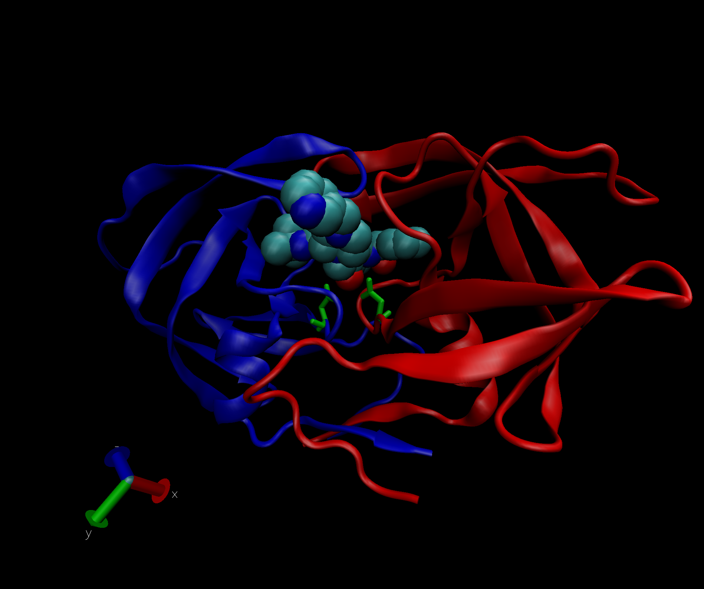
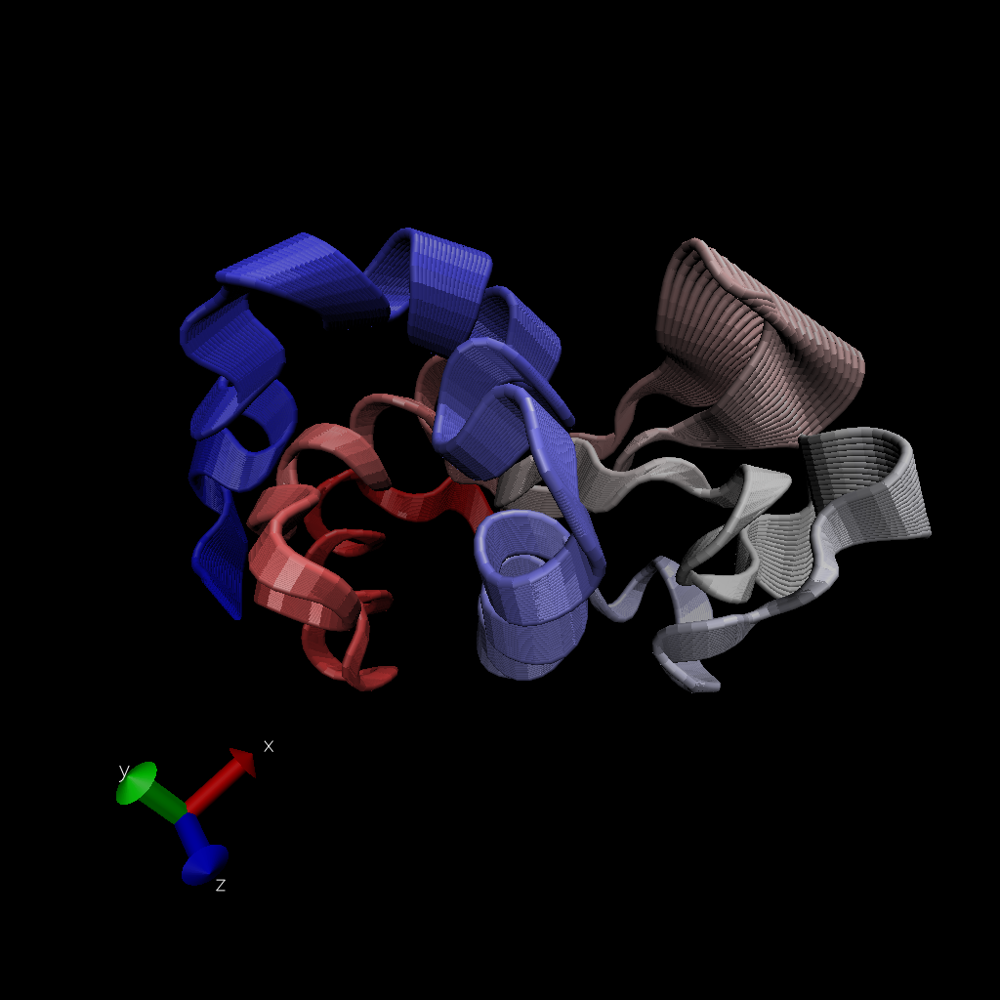

## Section 1: Introduction to the RCSB Protein Data Bank (PDB)

Q1: Download a CSV file from the PDB site (accessible from “Analyze” -> “PDB Statistics” > “by Experimental Method and Molecular Type”. Move this CSV file into your RStudio project and determine the percentage of structures solved by X-Ray and Electron Microscopy. Also can you determine what proportion of structures are protein?

```{r}
data = read.csv("Data Export Summary.csv", row.names = 1)
```

```{r}
# percentage solve by x-ray
sum(data$X.ray)/sum(data$Total) *100
# percentage solve by EM
sum(data$EM)/sum(data$Total)*100
# for every column
colSums(data)/sum(data$Total) *100
# what proportion of structures are protein?
data$Total[1]/sum(data$Total) *100
```
Q2: Type HIV in the PDB website search box on the home page and determine how many HIV-1 protease structures are in the current PDB?
73


## Using Bio3D in R for structural bioinformatics
```{r}
library(bio3d)
pdb = read.pdb("1hel")
pdb
```
```{r}
head(pdb$atom)
```

let's do quick bioinformatics prediction of protein dynamics (flexibility). we use the `nma()` function, which does normal mode analysis
```{r}
pdb = read.pdb("1hel")
m = nma(pdb)
plot(m)
```
make a movie(trajectory) for viewing in VMD
```{r}
mktrj(m,file="nma.pdb")
```
The image from VMD 

In VMD: draw style: 
  load new molecule
  graphics-> representation
  Drawing method. Tube, coloring method: Index
  Trajectory: Draw multiple frames: 0:100

## comparative structure analysis
start with a sequence of interest
```{r}
aa = get.seq("1AKE_A")
aa
```
Want to search the PDB database(the main database for exp structure) for sequence like my aa sequence 
```{r}
blast = blast.pdb(aa)
hits = plot(blast)
```

Now I have my top hits from the search of PDB
```{r}
hits$pdb.id
```
Download all these similar structure
```{r}
# Download releated PDB files
files <- get.pdb(hits$pdb.id, path="pdbs", split=TRUE, gzip=TRUE)
```


## Align and superpose structures

Next we will use the `pdbaln()` function to align and also optionally fit (i.e. superpose) the identified PDB structures.

```{r}
# Align releated PDBs
pdbs <- pdbaln(files, fit = TRUE)#, exefile="msa")
pdbs
```

```{r}
# Vector containing PDB codes for figure axis
ids <- basename.pdb(pdbs$id)

# Draw schematic alignment
plot(pdbs, labels=ids)
```
```{r}
pdb$xyz
```

## Principal Component Analysis (PCA)

Here we will do PCA on the xyz coordinate data of all these structures with the `pca()` function in bio3d

```{r}
pc=pca(pdbs)
plot(pc)
```
Let's visualize the displacement (the movement of the structure) that are captured by PC1

```{r}
mktrj(pc, pc=1, file="pca.pdb")
```


#2.2 Using Atom Selections
Q4: Water molecules normally have 3 atoms. Why do we see just one atom per water molecule in this structure?

A: because the system draw the water molecule as a whole and it will display HOH if you click on the molecule and see the label. 


Q5: There is a conserved water molecule in the binding site. Can you identify this water molecule? What residue number does this water molecule have (see note below)?

```{r}

```

