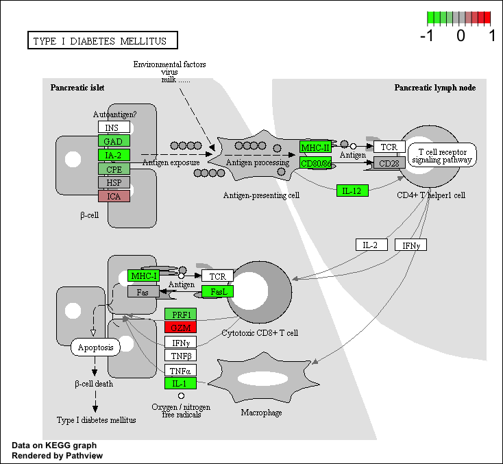
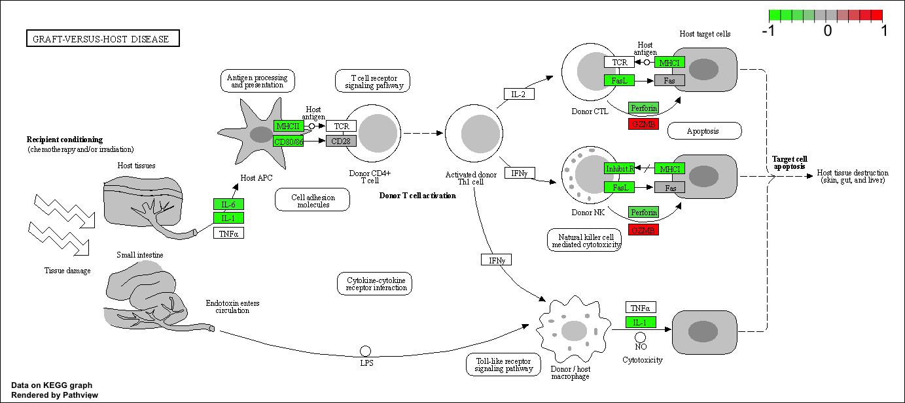

## Transcriptomics and the analysis of RNA-Seq data

`install.packages("BiocManager")` `BiocManager::install()`
`BiocManager::install("DESeq2")` `BiocManager::install("AnnotationDbi")`
`BiocManager::install("org.Hs.eg.db")`

```{r}
library(BiocManager)
library(DESeq2)
```

```{r}
counts <- read.csv("airway_scaledcounts.csv", row.names=1)
metadata <-  read.csv("airway_metadata.csv")
```

```{r}
head(metadata)
```

```{r}
head(counts)
```

Q1. How many genes are in this dataset?

```{r}
nrow(counts)
```

Q2. How many 'control' cell lines do we have?

```{r}
sum(metadata$dex == 'control')
```

##3. Toy differential gene expression Lets perform some exploratory
differential gene expression analysis. Note: this analysis is for
demonstration only. NEVER do differential expression analysis this way!

```{r}
control <- metadata[metadata[,"dex"]=="control",]
control.counts <- counts[ ,control$id]
control.mean <- rowSums( control.counts )/4 
head(control.mean)
```

Side-note: An alternative way to do this same thing using the dplyr
package from the tidyverse is shown below. Which do you prefer and why?

```{r}
library(dplyr)
control <- metadata %>% filter(dex=="control")
control.counts <- counts %>% select(control$id) 
control.mean <- rowSums(control.counts)/4
head(control.mean)
```

Q3. How would you make the above code in either approach more robust?

```{r}
control <- metadata[metadata$dex=="control",]
control.counts <- counts[ ,control$id]
control.mean <- rowSums( control.counts )/ncol(control.counts) 
head(control.mean)
```

Q4. Follow the same procedure for the treated samples (i.e. calculate
the mean per gene across drug treated samples and assign to a labeled
vector called treated.mean)

```{r}
treated.counts <- counts[ ,metadata[metadata$dex=="treated",]$id]
treated.mean <- rowSums( treated.counts )/ ncol(treated.counts)
head(treated.mean)

```

We will combine our meancount data for bookkeeping purposes.

```{r}
meancounts <- data.frame(control.mean, treated.mean)
```

```{r}
colSums(meancounts)
```

Q5 (a). Create a scatter plot showing the mean of the treated samples
against the mean of the control samples. Your plot should look something
like the following.

```{r}
plot(meancounts)
```

```{r}
plot(meancounts, log='xy')
```

Q5 (b).You could also use the ggplot2 package to make this figure
producing the plot below. What geom\_?() function would you use for this
plot?

```{r}
library(ggplot2)
ggplot(meancounts, aes(control.mean, treated.mean)) + geom_point(alpha = 0.3) + scale_x_continuous(trans="log2") + scale_y_continuous(trans="log2")
```

Here we calculate log2foldchange, add it to our meancounts data.frame
and inspect the results either with the head() or the View() function
for example.

```{r}
meancounts$log2fc <- log2(meancounts[,"treated.mean"]/meancounts[,"control.mean"])
head(meancounts)
```

There are a couple of "weird" results. Namely, the NaN ("not a number")
and -Inf (negative infinity) results.

The NaN is returned when you divide by zero and try to take the log. The
-Inf is returned when you try to take the log of zero. It turns out that
there are a lot of genes with zero expression. Let's filter our data to
remove these genes. Again inspect your result (and the intermediate
steps) to see if things make sense to you

```{r}
zero.vals <- which(meancounts[,1:2]==0, arr.ind=TRUE)

to.rm <- unique(zero.vals[,1]) # get all row index where 0s are
mycounts <- meancounts[-to.rm,]
head(mycounts)
```

Q7. What is the purpose of the arr.ind argument in the which() function
call above? Why would we then take the first column of the output and
need to call the unique() function?

A: which() returns the indices of all positions that evaluate to true.
we take the fist column because it records all the row numbers where O's
are. There could be duplicates since we have 2 columns in the dataset.
calling unique eliminates the duplicates (where the gene in both treated
and control is 0) so that we can delete all rows with 0's in the
dataset.

*A common threshold used for calling something differentially expressed
is a log2(FoldChange) of greater than 2 or less than -2. Let's filter
the dataset both ways to see how many genes are up or down-regulated.*

```{r}
# the percentage of log2fc > 2
round((sum(mycounts$log2fc > 2)/nrow(mycounts))*100, 2)
```

```{r}
up.ind <- mycounts$log2fc > 2
down.ind <- mycounts$log2fc < (-2)
```

Q8. Using the up.ind vector above can you determine how many up
regulated genes we have at the greater than 2 fc level?

```{r}
sum(up.ind)
```

Q9. Using the down.ind vector above can you determine how many down
regulated genes we have at the greater than 2 fc level?

```{r}
sum(down.ind)
```

Q10. Do you trust these results? Why or why not?

A: No, we did not do any statistical tests to show the significance of
these changes, thus it is not appropriate to draw any conclusion.

## 4. DESeq2 analysis

```{r}
citation("DESeq2")
```

```{r}
dds <- DESeqDataSetFromMatrix(countData=counts, 
                              colData=metadata, 
                              design=~dex)
dds
```

#DESeq analysis Next, let's run the DESeq analysis pipeline on the
dataset, and reassign the resulting object back to the same variable.
Note that before we start, dds is a bare-bones DESeqDataSet. The DESeq()
function takes a DESeqDataSet and returns a DESeqDataSet, but with
additional information filled in (including the differential expression
results we are after). Notice how if we try to access these results
before running the analysis, nothing exists.

Here, we're running the DESeq pipeline on the dds object, and
reassigning the whole thing back to dds, which will now be a
DESeqDataSet populated with all those values. Get some help on ?DESeq
(notice, no "2" on the end). This function calls a number of other
functions within the package to essentially run the entire pipeline
(normalizing by library size by estimating the "size factors,"
estimating dispersion for the negative binomial model, and fitting
models and getting statistics for each gene for the design specified
when you imported the data).

```{r}
dds <- DESeq(dds)
```

#Getting results Since we've got a fairly simple design (single factor,
two groups, treated versus control), we can get results out of the
object simply by calling the results() function on the DESeqDataSet that
has been run through the pipeline.

```{r}
res <- results(dds)
res
```

```{r}
summary(res)
```

The results function contains a number of arguments to customize the
results table. By default the argument alpha is set to 0.1. If the
adjusted p value cutoff will be a value other than 0.1, alpha should be
set to that value:

```{r}
res05 <- results(dds, alpha=0.05)
summary(res05)
```

## 5. Adding annotation data

Our result table so far only contains the Ensembl gene IDs. However,
alternative gene names and extra annotation are usually required for
informative interpretation of our results. In this section we will add
this necessary annotation data to our results.

We will use one of Bioconductor's main annotation packages to help with
mapping between various ID schemes. Here we load the AnnotationDbi
package and the annotation data package for humans org.Hs.eg.db.

```{r}
library("AnnotationDbi")
library("org.Hs.eg.db")
```

The later of these is is the organism annotation package ("org") for
Homo sapiens ("Hs"), organized as an AnnotationDbi database package
("db"), using Entrez Gene IDs ("eg") as primary key. To get a list of
all available key types that we can use to map between, use the
columns() function:

```{r}
columns(org.Hs.eg.db)
```

The main function we will use from the AnnotationDbi package is called
mapIds().

We can use the mapIds() function to add individual columns to our
results table. We provide the row names of our results table as a key,
and specify that keytype=ENSEMBL. The column argument tells the mapIds()
function which information we want, and the multiVals argument tells the
function what to do if there are multiple possible values for a single
input value. Here we ask to just give us back the first one that occurs
in the database.

```{r}
res$symbol <- mapIds(org.Hs.eg.db,
                     keys=row.names(res), # Our genenames
                     keytype="ENSEMBL",        # The format of our genenames
                     column="SYMBOL",          # The new format we want to add
                     multiVals="first")
```

```{r}
head(res)
```

Q11. Run the mapIds() function two more times to add the Entrez ID and
UniProt accession and GENENAME as new columns called `res$entrez`,
`res$uniprot` and `res$genename`.

```{r}
res$entrez <- mapIds(org.Hs.eg.db,
                     keys=row.names(res), # Our genenames
                     keytype="ENSEMBL",        # The format of our genenames
                     column="ENTREZID",          # The new format we want to add
                     multiVals="first")
res$uniprot <- mapIds(org.Hs.eg.db,
                     keys=row.names(res), # Our genenames
                     keytype="ENSEMBL",        # The format of our genenames
                     column="UNIPROT",          # The new format we want to add
                     multiVals="first")
res$genename <- mapIds(org.Hs.eg.db,
                     keys=row.names(res), # Our genenames
                     keytype="ENSEMBL",        # The format of our genenames
                     column="GENENAME",          # The new format we want to add
                     multiVals="first")
```

```{r}
head(res)
```

You can arrange and view the results by the adjusted p-value

```{r}
ord <- order( res$padj )
#View(res[ord,])
head(res[ord,])
```

Finally, let's write out the ordered significant results with
annotations. See the help for `?write.csv` if you are unsure here.

```{r}
write.csv(res[ord,], "deseq_results.csv")

```

##6. Data Visualization Volcano plots Let's make a commonly produced
visualization from this data, namely a so-called Volcano plot. These
summary figures are frequently used to highlight the proportion of genes
that are both significantly regulated and display a high fold change.

Typically these plots shows the log fold change on the X-axis, and the
−log10 of the p-value on the Y-axis (the more significant the p-value,
the larger the −log10 of that value will be). A very dull (i.e. non
colored and labeled) version can be created with a quick call to plot()
like so:

```{r}
# log fold change on the X-axis, and the −log10 of the p-value on the Y-axis 
plot( res$log2FoldChange,  -log(res$padj), 
      xlab="Log2(FoldChange)",
      ylab="-Log(P-value)")
```

To make this more useful we can add some guidelines (with the abline()
function) and color (with a custom color vector) highlighting genes that
have padj\<0.05 and the absolute log2FoldChange>2.

```{r}
plot( res$log2FoldChange,  -log(res$padj), 
 ylab="-Log(P-value)", xlab="Log2(FoldChange)")

# Add some cut-off lines
abline(v=c(-2,2), col="darkgray", lty=2)
abline(h=-log(0.05), col="darkgray", lty=2)
```

To color the points we will setup a custom color vector indicating
transcripts with large fold change and significant differences between
conditions:

```{r}
# Setup our custom point color vector 
mycols <- rep("gray", nrow(res)) #replicate 'gray' 
mycols[ abs(res$log2FoldChange) > 2 ]  <- "red" #log2fc >2 assigned red

inds <- (res$padj < 0.01) & (abs(res$log2FoldChange) > 2 )
mycols[ inds ] <- "blue"

# Volcano plot with custom colors 
plot( res$log2FoldChange,  -log(res$padj), 
 col=mycols, ylab="-Log(P-value)", xlab="Log2(FoldChange)" )

# Cut-off lines
abline(v=c(-2,2), col="gray", lty=2)
abline(h=-log(0.1), col="gray", lty=2)
```

For even more customization you might find the EnhancedVolcano
bioconductor package useful (Note. It uses ggplot under the hood):

First we will add the more understandable gene symbol names to our full
results object res as we will use this to label the most interesting
genes in our final plot.

`BiocManager::install("EnhancedVolcano")`

```{r}
library(EnhancedVolcano)
```

```{r}
x <- as.data.frame(res)
EnhancedVolcano(x,
    lab = x$symbol,
    x = 'log2FoldChange',
    y = 'pvalue')

```

##7. Pathway analysis Pathway analysis (also known as gene set analysis
or over-representation analysis), aims to reduce the complexity of
interpreting gene lists via mapping the listed genes to known (i.e.
annotated) biological pathways, processes and functions.

#Patway analysis with R and Bioconductor There are many freely available
tools for pathway or over-representation analysis. Ath the time of
writting Bioconductor alone has over 80 packages categorized under gene
set enrichment and over 120 packages categorized under pathways.

Here we play with just one, the GAGE package (which stands for Generally
Applicable Gene set Enrichment), to do KEGG pathway enrichment analysis
on our RNA-seq based differential expression results.

The KEGG pathway database, unlike GO for example, provides functional
annotation as well as information about gene products that interact with
each other in a given pathway, how they interact (e.g., activation,
inhibition, etc.), and where they interact (e.g., cytoplasm, nucleus,
etc.). Hence KEGG has the potential to provide extra insight beyond
annotation lists of simple molecular function, process etc. from GO
terms.

In this analysis, we check for coordinated differential expression over
gene sets from KEGG pathways instead of changes of individual genes. The
assumption here is that consistent perturbations over a given pathway
(gene set) may suggest mechanistic changes.

Once we have a list of enriched pathways from gage we will use the
pathview package to draw pathway diagrams, coloring the molecules in the
pathway by their degree of up/down-regulation.

First we need to do our one time install of these required bioconductor
packages:

    # Run in your R console (i.e. not your Rmarkdown doc!)
    BiocManager::install( c("pathview", "gage", "gageData") )

Now we can load the packages and setup the KEGG data-sets we need. The
gageData package has pre-compiled databases mapping genes to KEGG
pathways and GO terms for common organisms. kegg.sets.hs is a named list
of 229 elements. Each element is a character vector of member gene
Entrez IDs for a single KEGG pathway.

```{r message=FALSE}
library(pathview)
library(gage)
library(gageData)

data(kegg.sets.hs)

# Examine the first 2 pathways in this kegg set for humans
head(kegg.sets.hs, 2)
```

The main gage() function requires a named vector of fold changes, where
the names of the values are the Entrez gene IDs.

Note that we used the mapIDs() function above to obtain Entrez gene IDs
(stored in `res$entrez`) and we have the fold change results from DESeq2
analysis (stored in `res$log2FoldChange`).

```{r}
foldchanges = res$log2FoldChange
names(foldchanges) = res$entrez
head(foldchanges)
```

```{r}
# Get the results
keggres = gage(foldchanges, gsets=kegg.sets.hs)
```

See help on the gage function with ?gage. Specifically, you might want
to try changing the value of same.dir. This value determines whether to
test for changes in a gene set toward a single direction (all genes up
or down regulated) or changes towards both directions simultaneously
(i.e. any genes in the pathway dysregulated). Here, we're using the
default same.dir=TRUE, which will give us separate lists for pathways
that are upregulated versus pathways that are down-regulated.

Now lets look at the object returned from gage().

```{r}
attributes(keggres)
```

It is a list with three elements, "greater", "less" and "stats".

You can also see this in your Environmnet panel/tab window of RStudio or
use the R command str(keggres).

Like any list we can use the dollar syntax to access a named element,
e.g. `head(keggres$greater)` and `head(keggres$less)`.

Lets look at the first few down (less) pathway results

```{r}
# Look at the first three down (less) pathways
head(keggres$less, 3)

```

Each `keggres$less` and `keggres$greater` object is data matrix with
gene sets as rows sorted by p-value.

Now, let's try out the pathview() function from the pathview package to
make a pathway plot with our RNA-Seq expression results shown in color.
To begin with lets manually supply a pathway.id (namely the first part
of the "hsa05310 Asthma") that we could see from the print out above

```{r}
pathview(gene.data=foldchanges, pathway.id="hsa05310")
```

 Note how many of the genes in this pathway
are perturbed (i.e. colored) in our results.

You can play with the other input arguments to pathview() to change the
display in various ways including generating a PDF graph. For example:

```{r}
pathview(gene.data=foldchanges, pathway.id="hsa05310", kegg.native=FALSE)
```

 

Can you do the same procedure as above to plot the pathview figures for
the top 2 down-reguled pathways?

```{r}
pathview(gene.data=foldchanges, pathway.id="hsa04940")

pathview(gene.data=foldchanges, pathway.id="hsa05332")
```





## OPTIONAL: Plotting counts for genes of interest

DESeq2 offers a function called plotCounts() that takes a DESeqDataSet
that has been run through the pipeline, the name of a gene, and the name
of the variable in the colData that you're interested in, and plots
those values. See the help for ?plotCounts. Let's first see what the
gene ID is for the CRISPLD2 gene using:

```{r}
i <- grep("CRISPLD2", res$symbol)
res[i,]

```

```{r}
rownames(res[i,])
```

Now, with that gene ID in hand let's plot the counts, where our
intgroup, or "interesting group" variable is the "dex" column.

```{r}
plotCounts(dds, gene="ENSG00000103196", intgroup="dex")
```

That's just okay. Keep looking at the help for ?plotCounts. Notice that
we could have actually returned the data instead of plotting. We could
then pipe this to ggplot and make our own figure. Let's make a boxplot.

```{r}
d <- plotCounts(dds, gene="ENSG00000103196", intgroup="dex", returnData=TRUE)
head(d)
# a formula, such as y ~ grp, where y is a numeric vector of data values to be split into groups according to the grouping variable grp (usually a factor). 
boxplot(count ~ dex , data=d)
```

As the returned object is a data.frame it is also all setup for ggplot2
based plotting. For example:

```{r}
library(ggplot2)
ggplot(d, aes(dex, count, fill=dex)) + 
  geom_boxplot() + 
  scale_y_log10() + 
  ggtitle("CRISPLD2")
```

Session Information The sessionInfo() prints version information about R
and any attached packages. It's a good practice to always run this
command at the end of your R session and record it for the sake of
reproducibility in the future.

```{r}
sessionInfo()
```
