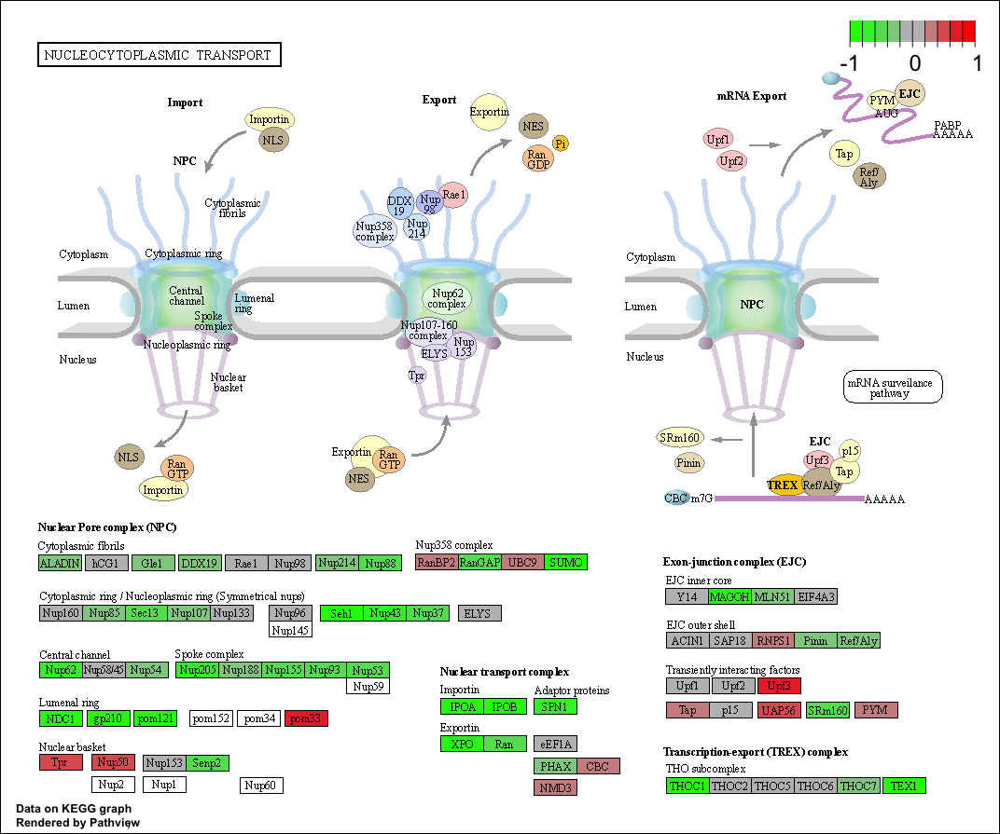

## Section 1. Differential Expression Analysis

You can download the count data and associated metadata from here: GSE37704_featurecounts.csv and GSE37704_metadata.csv. This is similar to our starting point for the last class where we used DESeq2 for the first time. We will use it again today!

```{r message=FALSE}
library(DESeq2)
```

```{r}
metaFile <- "GSE37704_metadata.csv"
countFile <- "GSE37704_featurecounts.csv"

# Import metadata and take a peak
colData = read.csv(metaFile, row.names=1)
head(colData)
```

```{r}
# Import countdata
countData = read.csv(countFile, row.names=1)
head(countData)
```

Q. Complete the code below to remove the troublesome first column from countData

```{r}
# Note we need to remove the odd first $length col
countData <- as.matrix(countData[, -which(names(countData) == "length") ])
head(countData)
```

Q. Complete the code below to filter countData to exclude genes (i.e. rows) where we have 0 read count across all samples (i.e. columns).

Tip: What will rowSums() of countData return and how could you use it in this context?

```{r}
data = countData[-which(rowSums(countData) == 0),]
head(data)
countData = data
```

## PCA

```{r}
pca = prcomp(t(countData))
summary(pca)
```

```{r}
plot(pca$x[,1:2], pch=16, col=as.factor(colData$condition))
text(pca$x[,1:2], labels=colData$condition)
```

or a ggplot version

```{r}
library(ggplot2)
x = as.data.frame(pca$x[,1:2])
x$condition = colData$condition
ggplot(x, aes(PC1, PC2, col=condition)) + geom_point()
```

## Running DESeq2

Nice now lets setup the DESeqDataSet object required for the DESeq() function and then run the DESeq pipeline. This is again similar to our last days hands-on session.

```{r}
dds = DESeqDataSetFromMatrix(countData=countData,
                             colData=colData,
                             design=~condition)
dds = DESeq(dds)
```

Next, get results for the HoxA1 knockdown versus control siRNA (remember that these were labeled as "hoxa1_kd" and "control_sirna" in our original colData metaFile input to DESeq, you can check this above and by running resultsNames(dds) command).

```{r}
res = results(dds)
```

Q. Call the summary() function on your results to get a sense of how many genes are up or down-regulated at the default 0.1 p-value cutoff.

```{r}
summary(res)
```

## Volcono plot

Now we will make a volcano plot, a commonly produced visualization from this type of data that we introduced last day. Basically it's a plot of log2 fold change vs -log adjusted p-value.

```{r}
plot( res$log2FoldChange, -log(res$padj) )
```

```{r}
# Make a color vector for all genes
mycols <- rep("gray", nrow(res) )

# Color red the genes with absolute fold change above 2
mycols[ abs(res$log2FoldChange) > 2 ] <- "red"

# Color blue those with adjusted p-value less than 0.01
#  and absolute fold change more than 2
inds <- (res$padj < 0.01) & (abs(res$log2FoldChange) > 2 )
mycols[ inds ] <- "blue"

plot( res$log2FoldChange, -log(res$padj), col=mycols, xlab="Log2(FoldChange)", ylab="-Log(P-value)" )
```

## Adding gene annotation

Since we mapped and counted against the Ensembl annotation, our results only have information about Ensembl gene IDs. However, our pathway analysis downstream will use KEGG pathways, and genes in KEGG pathways are annotated with Entrez gene IDs. So lets add them as we did the last day.

Q. Use the mapIDs() function multiple times to add SYMBOL, ENTREZID and GENENAME annotation to our results by completing the code below.

```{r}
library("AnnotationDbi")
library("org.Hs.eg.db")

columns(org.Hs.eg.db)

res$symbol = mapIds(org.Hs.eg.db,
                    keys=row.names(res), 
                    keytype="ENSEMBL",
                    column="SYMBOL",
                    multiVals="first")

res$entrez = mapIds(org.Hs.eg.db,
                    keys=row.names(res),
                    keytype="ENSEMBL",
                    column="ENTREZID",
                    multiVals="first")

res$name =   mapIds(org.Hs.eg.db,
                    keys=row.names(res),
                    keytype="ENSEMBL",
                    column= "GENENAME",
                    multiVals="first")

head(res, 10)
```

Q. Finally for this section let's reorder these results by adjusted p-value and save them to a CSV file in your current project directory.

```{r}
res = res[order(res$pvalue),]
write.csv(res, "deseq_results.csv")
```

## Section 2. Pathway Analysis

Here we are going to use the gage package for pathway analysis. Once we have a list of enriched pathways, we're going to use the pathview package to draw pathway diagrams, shading the molecules in the pathway by their degree of up/down-regulation.

# KEGG pathways

The gageData package has pre-compiled databases mapping genes to KEGG pathways and GO terms for common organisms. kegg.sets.hs is a named list of 229 elements. Each element is a character vector of member gene Entrez IDs for a single KEGG pathway. (See also go.sets.hs). The sigmet.idx.hs is an index of numbers of signaling and metabolic pathways in kegg.set.gs. In other words, KEGG pathway include other types of pathway definitions, like "Global Map" and "Human Diseases", which may be undesirable in a particular pathway analysis. Therefore, kegg.sets.hs\[sigmet.idx.hs\] gives you the "cleaner" gene sets of signaling and metabolic pathways only.

```{r}
library(pathview)
library(gage)
library(gageData)

data(kegg.sets.hs)
data(sigmet.idx.hs)

# Focus on signaling and metabolic pathways only
kegg.sets.hs = kegg.sets.hs[sigmet.idx.hs]

# Examine the first 3 pathways
head(kegg.sets.hs, 3)
```

```{r}
foldchanges = res$log2FoldChange
names(foldchanges) = res$entrez
head(foldchanges)
# Get the results
keggres = gage(foldchanges, gsets=kegg.sets.hs)
attributes(keggres)
# Look at the first few down (less) pathways
head(keggres$less)
```

```{r}
pathview(gene.data=foldchanges, pathway.id="hsa04110")

```


```{r}
# A different PDF based output of the same data
pathview(gene.data=foldchanges, pathway.id="hsa04110", kegg.native=FALSE)
```


```{r}
## Focus on top 5 upregulated pathways here for demo purposes only
keggrespathways <- rownames(keggres$greater)[1:5]

# Extract the 8 character long IDs part of each string
keggresids = substr(keggrespathways, start=1, stop=8)
keggresids
```

```{r}
pathview(gene.data=foldchanges, pathway.id=keggresids, species="hsa")

```

    

Q. Can you do the same procedure as above to plot the pathview figures for the top 5 down-reguled pathways?

```{r}
## Focus on top 5 downregulated pathways here for demo purposes only
keggrespathways <- rownames(keggres$less)[1:5]

# Extract the 8 character long IDs part of each string
keggresids = substr(keggrespathways, start=1, stop=8)
keggresids
```

```{r}
pathview(gene.data=foldchanges, pathway.id=keggresids, species="hsa")

```

    

## Section 3. Gene Ontology (GO)

We can also do a similar procedure with gene ontology. Similar to above, go.sets.hs has all GO terms. go.subs.hs is a named list containing indexes for the BP, CC, and MF ontologies. Let's focus on BP (a.k.a Biological Process) here.

```{r}
data(go.sets.hs)
data(go.subs.hs)

# Focus on Biological Process subset of GO
gobpsets = go.sets.hs[go.subs.hs$BP]

gobpres = gage(foldchanges, gsets=gobpsets, same.dir=TRUE)

lapply(gobpres, head)
```

```{r}
sig_genes <- res[res$padj <= 0.05 & !is.na(res$padj), "symbol"]
print(paste("Total number of significant genes:", length(sig_genes)))
```

```{r}
write.table(sig_genes, file="significant_genes.txt", row.names=FALSE, col.names=FALSE, quote=FALSE)
```

Then, to perform pathway analysis online go to the Reactome website (<https://reactome.org/PathwayBrowser/#TOOL=AT>). Select "choose file" to upload your significant gene list. Then, select the parameters "Project to Humans", then click "Analyze".

Q: What pathway has the most significant "Entities p-value"? Do the most significant pathways listed match your previous KEGG results? What factors could cause differences between the two methods?

A: Endosomal/Vacuolar pathway has the most significant "Entities p-value"
